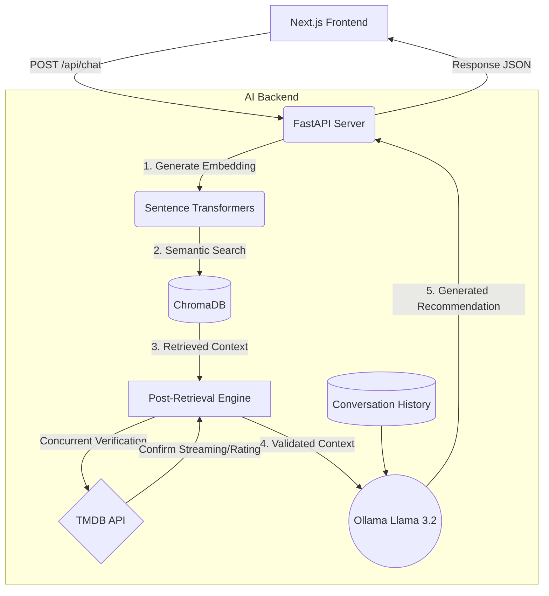

# Agentic RAG Movie Recommender 🍿🤖


An ultra-fast, intelligent, context-aware movie recommendation system powered by **Retrieval-Augmented Generation (RAG)**. 

This project bridges a sleek **Next.js frontend** with a robust **FastAPI Python backend**, utilizing an offline **Ollama LLM (Llama 3.2)**, **ChromaDB** for vector semantic search, and the **TMDB API** for live metadata streaming (like streaming platforms and cast information).

---

## 🎯 Overview

**Agentic RAG Movie Recommender** is an advanced movie recommendation system that combines the power of Large Language Models (LLMs) with semantic search capabilities to provide intelligent, context-aware movie suggestions. Unlike traditional recommendation systems that rely solely on user ratings or collaborative filtering, this agent considers natural language queries, maintains conversation context, and validates real-time streaming availability using concurrent network requests.

### What Makes It Special?
- 🧠 **Context-Aware Conversations**: Remembers previous interactions to allow for organic, multi-turn follow-up questions.
- 🚀 **Asynchronous Validation**: Concurrent threading dynamically checks TMDB for live ratings and streaming provider availability, dropping invalid movies before they reach the LLM's context window. 
- 💬 **Semantic Search**: Finds movies based on plot meaning and vibe, not just title keywords.
- 🎨 **Premium UI**: Netflix-inspired dark theme built in Next.js with glassmorphic elements and interactive cast accordions.
- 🔒 **100% Free LLM**: No paid API barriers; the natural language generation runs entirely on your local machine using Ollama.

### Use Cases
- **Vibe-based Discovery**: Find hidden gems based on mood, specific genres, or complex plot themes (e.g., "mind-bending sci-fi with a twist ending").
- **Availability Filtering**: "What are some highly-rated comedies actually available on Netflix right now?"
- **Conversational Exploration**: Discover movies through natural dialogue ("Tell me more about the second one" or "Show me something older").

---

## ✨ Features

- **💡 Semantic Search RAG:** Instead of exact keyword matching, the system understands the *vibe* and *meaning* of your request using Sentence Transformers.
- **📚 Multi-turn Memory:** The LLM remembers up to 5 turns of conversation, allowing you to ask follow-up questions organically without repeating previous context.
- **🚀 Parallel Network Threading:** Live TMDB API enrichment (fetching cast, ratings, and streaming availability) is multithreaded using `concurrent.futures`, reducing network wait times by over 70%.
- **🎨 Glassmorphic UI:** A beautifully responsive, futuristic Next.js React frontend inspired by premium dark-mode streaming platforms.
- **🎤 Voice Input Ready:** Built-in web speech recognition lets you simply click the microphone and ask for movies out loud.
- **⏸️ Cancel Mid-Flight:** Change your mind? Click the "Cancel" button while it's generating to abort the network request and instantly restore your prompt text.
- **🎬 Expandable Cast Accordions:** Click "View Details" on generated movie cards to seamlessly drop down the top-billed cast.
- **🛑 Strict Metadata Filtering:** The AI is strictly firewalled to only recommend movies that match your runtime filters (e.g. "Only movies on Netflix with an 8.0+ Rating").

---

## 🏗️ Architecture



### 🛠️ Technology Stack

#### Frontend Layer
- **Next.js (React 18)**: The foundational React framework for building our highly responsive, modern, and SEO-friendly user interface.
- **Vanilla CSS Modules**: Scoped stylesheet isolation ensuring the premium Netflix-esque Glassmorphic visual aesthetic remains contained and responsive.
- **React Markdown**: Renders the AI's plain-text markdown responses into parsed HTML with formatting, bolding, and lists.

#### API & Backend Layer
- **FastAPI**: A modern, high-performance web framework for building APIs with Python. It serves as the bridge accepting requests from Next.js and orchestrating the AI logic.
- **Uvicorn**: An ASGI web server implementation for Python, providing lightning-fast async request handling for FastAPI.

#### Artificial Intelligence Core
- **LangChain**: A framework for developing applications powered by language models. It manages our prompt templating, conversational memory buffers, and chain orchestration.
- **Ollama (Llama 3.2)**: A local LLM runtime environment. We use Meta's efficient Llama 3.2 model to process context and generate human-like, conversational recommendations without paying for cloud API credits.
- **Sentence Transformers (`all-MiniLM-L6-v2`)**: A lightweight embedding model that mathematically represents the meaning of text, converting user prompts into dense vectors for fast database similarity searches.

#### Data & External Services
- **ChromaDB**: An open-source, local vector database. It permanently stores the mathematical embeddings of our movie library allowing for rapid semantic similarity lookups.
- **TMDB API**: The Movie Database API. We query this service concurrently during the generative process to pull live streaming data, real-time ratings, movie posters, and cast/crew billing.

---

### RAG Pipeline Flow

```text
User Query: "Find me a dark thriller on Netflix from the 2010s"
                            │
                            ▼
┌────────────────────────────────────────────────────────┐
│ Step 1: Query Enhancement & Parsing                    │
│ - Validate user frontend filters (Genre, Netflix, etc.)│
│ - Retrieve last 5 turns of conversation memory         │
│ Output: Local context dictionary                       │
└────────────────┬───────────────────────────────────────┘
                 │
                 ▼
┌────────────────────────────────────────────────────────┐
│ Step 2: Vector Retrieval (ChromaDB)                    │
│ - Convert user prompt to 384-dim semantic vector       │
│ - Pre-filter metadata (Year >= 2010, Year <= 2019)     │
│ - Retrieve Top-15 most semantically similar movie plots│
└────────────────┬───────────────────────────────────────┘
                 │
                 ▼
┌────────────────────────────────────────────────────────┐
│ Step 3: Concurrent Post-Retrieval Validation           │
│ - Spin up ThreadPoolExecutor for 15 concurrent tasks   │
│ - Ping TMDB API `/search/movie` & `/watch/providers`   │
│ - Drop any movie NOT available on Netflix              │
│ Output: Top-K strictly verified candidate movies       │
└────────────────┬───────────────────────────────────────┘
                 │
                 ▼
┌────────────────────────────────────────────────────────┐
│ Step 4: Context Assembly                               │
│ - Format the surviving documents into a clear string   │
│ - Inject system instructions, memory, and context      │
│ Output: Master Prompt for the LLM                      │
└────────────────┬───────────────────────────────────────┘
                 │
                 ▼
┌────────────────────────────────────────────────────────┐
│ Step 5: LLM Generation (Ollama Llama 3.2)              │
│ - Process the Master Prompt locally                    │
│ - Generate a natural language response dynamically     │
│ Output: "I recommend 'Prisoners' (2013) because..."    │
└────────────────┬───────────────────────────────────────┘
                 │
                 ▼
┌────────────────────────────────────────────────────────┐
│ Step 6: Visual Metadata Enrichment                     │
│ - Spin up ThreadPoolExecutor over final LLM selections │
│ - Fetch high-res TMDB poster URLs                      │
│ - Fetch TMDB Top 5 Cast billing                        │
│ Output: Final JSON payload containing markdown & UI    │
└────────────────────────────────────────────────────────┘
```

### Data Flow Diagram

```text
Raw Data → Processing → Vector Store → Search → Concurrency → AI Generation
   │           │             │            │           │             │
   ▼           ▼             ▼            ▼           ▼             ▼
 Kaggle     Pandas        ChromaDB    Semantic   ThreadPool      Ollama 
 Datasets   Merging       Embeddings  Distance   Validation      Llama 3.2
 (CSV)      Cleaning      (Local)     Sorting    (TMDB API)      (Local)
```

---

## 🚀 Getting Started

### 1. Prerequisites
- **Python 3.9+**
- **Node.js 18+** & NPM
- **Ollama** installed on your machine (`ollama pull llama3.2`)
- **TMDB API Key** (Get yours for free at [developer.themoviedb.org](https://developer.themoviedb.org/))

### 2. Environment Variables
In the root directory, create a `.env` file:
```env
# .env
TMDB_API_KEY=your_secret_tmdb_api_key_here
```

### 3. Backend Setup (FastAPI)
Open a terminal and set up the Python environment:
```bash
# Create and activate virtual environment
python -m venv .venv
source .venv/bin/activate  # On Windows: .venv\Scripts\activate

# Install Python requirements
pip install -r requirements.txt

# (Optional Data Pipeline - Only needed if you are changing the underlying data)
# python src/data_ingestion.py
# python src/vectorstore.py

# Launch the FastAPI server (Runs on port 8000)
python main.py
```

### 4. Frontend Setup (Next.js)
Open a **second** terminal and navigate to the `frontend` folder:
```bash
cd frontend

# Install Node dependencies
npm install

# Start the Next.js development server
npm run dev
```

### 5. Start Chatting!
Open your browser and navigate to **[http://localhost:3000](http://localhost:3000)**. 
Select your mood, toggle your filters in the sidebar, or just click the microphone and start speaking!

---

## 📂 Project Structure

```text
agentic-rag-movie-recommender/
├── app.py                   # Legacy Streamlit UI (Archived)
├── main.py                  # Entrypoint for the FastAPI Server
├── requirements.txt         # Python backend dependencies
├── README.md                # Project documentation
├── .env                     # Contains TMDB_API_KEY
│
├── frontend/                # Next.js Application
│   ├── app/                 # React Pages, Layout, and CSS Modules
│   └── public/              # Static Frontend Assets
│
├── src/                     # Python Source Code
│   ├── rag_chain.py         # Core Langchain logic, memory, and TMDB concurrent networking
│   ├── vectorstore.py       # Interfacing natively with ChromaDB
│   └── data_ingestion.py    # Merging TMDB + Netflix datasets into semantic chunks
│
├── data/                    # Local storage (ignored by git)
│   ├── raw/                 # Original CSVs
│   ├── conversations/       # Local JSON conversation history saves
│   └── vectorstore/         # Persisted ChromaDB binaries
│
├── tests/                   # Python API Request test suites
├── scripts/                 # Auxiliary helper scripts
└── logs/                    # Output logs
```