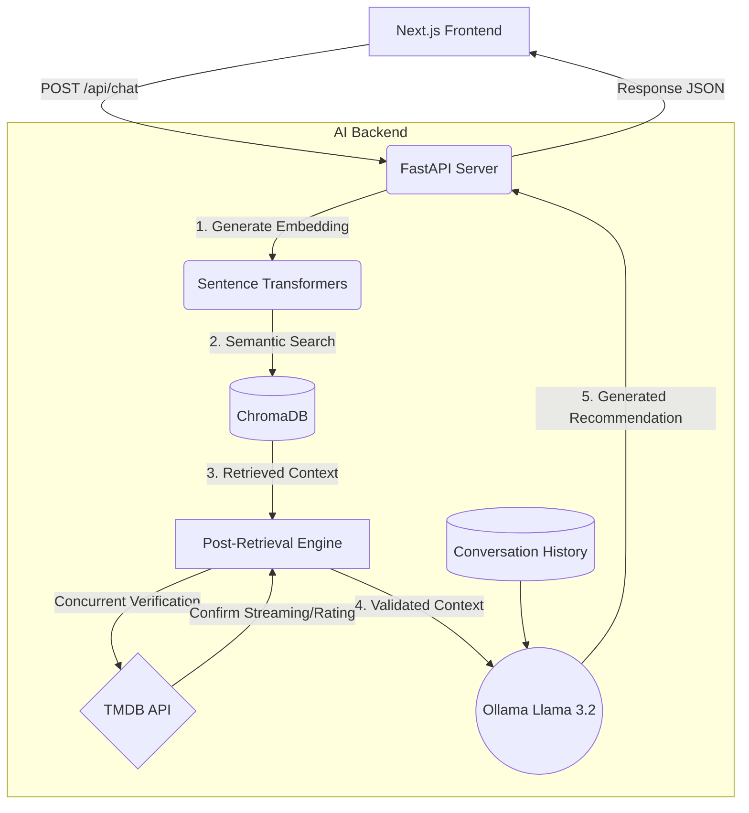

# Agentic RAG Movie Recommender 🍿🤖


An ultra-fast, intelligent, context-aware movie recommendation system powered by **Retrieval-Augmented Generation (RAG)**. 

This project bridges a sleek **Next.js frontend** with a robust **FastAPI Python backend**, utilizing an offline **Ollama LLM (Llama 3.2)**, **ChromaDB** for vector semantic search, and the **TMDB API** for live metadata streaming (like streaming platforms and cast information).

---

## ✨ Features

- **💡 Semantic Search RAG:** Instead of exact keyword matching, the system understands the *vibe* and *meaning* of your request using Sentence Transformers.
- **📚 Multi-turn Memory:** The LLM remembers up to 5 turns of conversation, allowing you to ask follow-up questions organically without repeating previous context.
- **🚀 Parallel Network Threading:** Live TMDB API enrichment (fetching cast, ratings, and streaming availability) is multithreaded using `concurrent.futures`, reducing network wait times by over 70%.
- **🎨 Glassmorphic UI:** A beautifully responsive, futuristic Next.js React frontend inspired by premium dark-mode streaming platforms.
- **🎤 Voice Input Ready:** Built-in web speech recognition lets you simply click the microphone and ask for movies out loud.
- **⏸️ Cancel Mid-Flight:** Change your mind? Click the "Cancel" button while it's generating to abort the network request and instantly restore your prompt text.
- **🎬 Expandable Cast Accordions:** Click "View Details" on generated movie cards to seamlessly drop down the top-billed cast.
- **🛑 Strict Metadata Filtering:** The AI is strictly firewalled to only recommend movies that match your runtime filters (e.g. "Only movies on Netflix with an 8.0+ Rating").

---

## 🏗️ Architecture



### Tech Stack
- **Frontend:** Next.js (React 18), Vanilla CSS Modules, React Markdown
- **Backend Core:** FastAPI, Uvicorn, Python 3.9+
- **AI Framework:** LangChain (Chains & Prompts)
- **Local Large Language Model:** Ollama (Llama 3.2)
- **Vector Database:** ChromaDB (Local Persisted)
- **Third-Party APIs:** TMDB (The Movie Database)

---

## 🚀 Getting Started

### 1. Prerequisites
- **Python 3.9+**
- **Node.js 18+** & NPM
- **Ollama** installed on your machine (`ollama pull llama3.2`)
- **TMDB API Key** (Get yours for free at [developer.themoviedb.org](https://developer.themoviedb.org/))

### 2. Environment Variables
In the root directory, create a `.env` file:
```env
# .env
TMDB_API_KEY=your_secret_tmdb_api_key_here
```

### 3. Backend Setup (FastAPI)
Open a terminal and set up the Python environment:
```bash
# Create and activate virtual environment
python -m venv .venv
source .venv/bin/activate  # On Windows: .venv\Scripts\activate

# Install Python requirements
pip install -r requirements.txt

# (Optional Data Pipeline - Only needed if you are changing the underlying data)
# python src/data_ingestion.py
# python src/vectorstore.py

# Launch the FastAPI server (Runs on port 8000)
python main.py
```

### 4. Frontend Setup (Next.js)
Open a **second** terminal and navigate to the `frontend` folder:
```bash
cd frontend

# Install Node dependencies
npm install

# Start the Next.js development server
npm run dev
```

### 5. Start Chatting!
Open your browser and navigate to **[http://localhost:3000](http://localhost:3000)**. 
Select your mood, toggle your filters in the sidebar, or just click the microphone and start speaking!

---

## 📂 Project Structure

```text
agentic-rag-movie-recommender/
├── app.py                   # Legacy Streamlit UI (Archived)
├── main.py                  # Entrypoint for the FastAPI Server
├── requirements.txt         # Python backend dependencies
├── README.md                # Project documentation
├── .env                     # Contains TMDB_API_KEY
│
├── frontend/                # Next.js Application
│   ├── app/                 # React Pages, Layout, and CSS Modules
│   └── public/              # Static Frontend Assets
│
├── src/                     # Python Source Code
│   ├── rag_chain.py         # Core Langchain logic, memory, and TMDB concurrent networking
│   ├── vectorstore.py       # Interfacing natively with ChromaDB
│   └── data_ingestion.py    # Merging TMDB + Netflix datasets into semantic chunks
│
├── data/                    # Local storage (ignored by git)
│   ├── raw/                 # Original CSVs
│   ├── conversations/       # Local JSON conversation history saves
│   └── vectorstore/         # Persisted ChromaDB binaries
│
├── tests/                   # Python API Request test suites
├── scripts/                 # Auxiliary helper scripts
└── logs/                    # Output logs
```